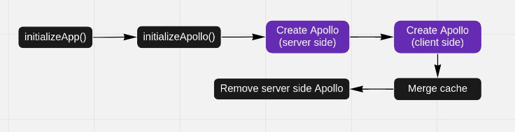
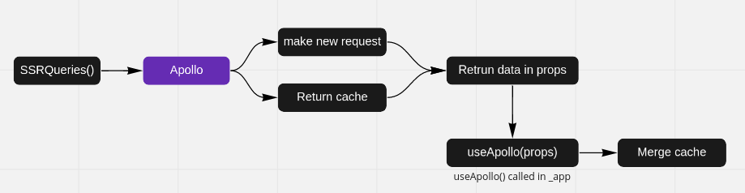
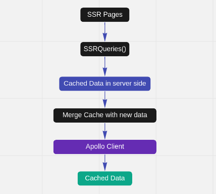
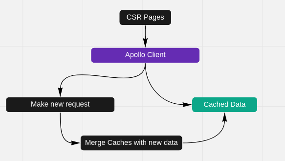

# 2.Module Architecture

In the first step, the App takes the **_app Component** and **themeConfiguration**

_If the request does not originate the server, for each request all steps are done from the beginning._

---

As soon as a new request is sent to the server (if it is not already in the Apollo cache), useApollo automatically
merges the old cache with the new data, and all the sections that depend on that data are updated.

---

There are two types of pages in the theme kit (SSR and CSR). On SSR pages however in the first step, SSRQueries run then
useQuery inside of the hook uses the state cache

_SSR requests will only be sent to the server if no window exists. This means that there is a window when the user
clicks on a link inside the app, so the request is sent after the page is rendered._

_**Note:** Occasionally, dynamic rendering was enabled in the **pathConfig** and requests were only sent from the server
when requests originated from the search engine._

However, SSRQueries is not called in CSR pages. As a result, no request will be made to the server before rendering.
